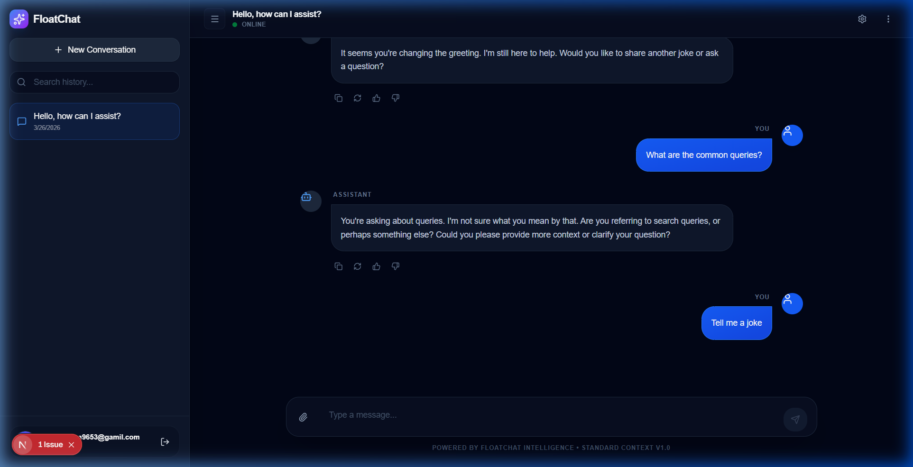

# FloatChat: Next-Gen Context-Aware AI Assistant



FloatChat is a highly advanced, multi-modal AI chatbot built with a **Next.js** frontend and a dedicated **FastAPI Python NLP microservice**. It bridges the gap between traditional chat applications and modern contextual AI architectures—featuring advanced semantic memory search, real-time sentiment analysis, and seamless multi-modal vision capabilities.

## 🚀 Engineering & Features

- **Semantic Memory Search (Context-Awareness)**: Operates with persistent conversational memory! User input is mathematically mapped into dense vector embeddings via `SentenceTransformers` (`all-MiniLM-L6-v2`) and cross-referenced against historical chat nodes via cosine distance. This empowers the AI to naturally recall past context and discussions.
- **Multi-Modal Vision System**: The backend securely scales hardware requirements natively, swapping on-the-fly between `llama-3.1-8b` for rapid text generation and `llama-3.2-11b-vision-preview` to ingest, break down, and reason over visual image attachments.
- **Asynchronous NLP Pipeline**: Performs localized embedding computation, sentiment analysis inference (`distilbert`), and user-intent categorization completely asynchronously. The separation of these computational layers allows the main Chat stream to maintain a stunning zero-latency Time-To-First-Byte (TTFB).
- **Predictive Smart Replies**: Uses deep context-parsing to compute and suggest the 3 most highly relevant, clickable follow-up conversational questions for the end User.
- **Universal Authentication**: Supports Google, GitHub, and SMS Phone Number verification utilizing Firebase decoupled Auth.

## 💻 Tech Stack & Cloud Infrastructure

- **Frontend Scale**: Next.js 14 App Router, React 19, Tailwind CSS v4, Prisma ORM, Lucide Icons.
- **AI / NLP Backend**: Python 3.11, FastAPI, HuggingFace Transformers, PyTorch CPU-compiled, Groq Cloud LLM engine.
- **Deployment Strategy**:
  - **Netlify**: Globally handles the serverless Next.js edge-rendering. Features dynamically deferred Firebase Admin Initializers to pass strict server build requirements.
  - **Railway**: Hosts the dedicated Dockerized Python FastAPI microservice. The environment is heavily optimized utilizing build-phase HuggingFace model cache-baking and custom health-check probe routes to pass strict 1GB memory constraints and prevent OOM timeout loops.

## ⚙️ Local Development

### 1. Boot the NLP Microservice
Navigate into the Python folder, activate the venv environment, and ignite the FastAPI server:
```bash
cd nlp-service
./venv/Scripts/activate
uvicorn main:app --port 8000 --reload
```

### 2. Boot the Next.js Client
In a secondary terminal window from the root directory:
```bash
npm run dev
```

Visit the running frontend application at `http://localhost:3000`.

---
**Software Engineering by**: [Nilesh Rathore](https://github.com/nileshrathore22)
